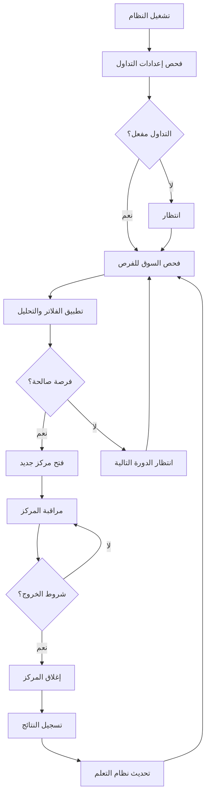
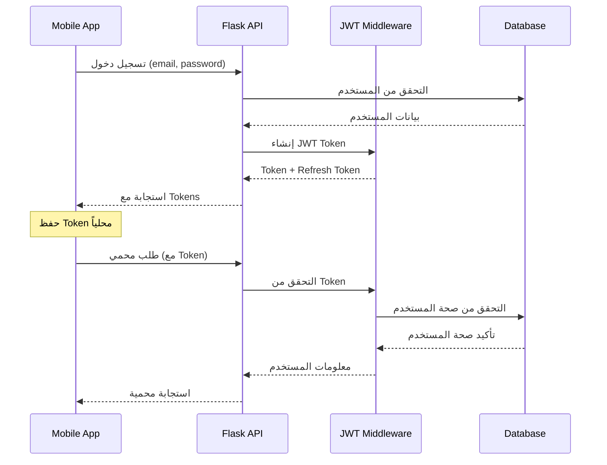
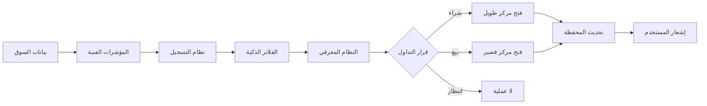

# 🏛️ معمارية نظام التداول الذكي

## نظرة عامة على المعمارية

نظام التداول مبني على معمارية microservices مع فصل واضح للمسؤوليات:

```
┌─────────────────────────────────────────────────────────────┐
│                    PRESENTATION LAYER                       │
│  📱 React Native App (Arabic UI) + 🌐 Admin Web Interface  │
└─────────────────┬───────────────────────────────────────────┘
                  │ HTTP/REST API
┌─────────────────▼───────────────────────────────────────────┐
│                   APPLICATION LAYER                         │
│  🔥 Flask API Server (Port 3002) + 🔐 JWT Auth            │
└─────────────────┬───────────────────────────────────────────┘
                  │
┌─────────────────▼───────────────────────────────────────────┐
│                    BUSINESS LAYER                           │
│  🤖 Trading Engine + 🧠 Cognitive System + 📊 ML Engine   │
└─────────────────┬───────────────────────────────────────────┘
                  │
┌─────────────────▼───────────────────────────────────────────┐
│                     DATA LAYER                              │
│  🗄️ SQLite Database + 📁 File Storage + 💾 Cache          │
└─────────────────┬───────────────────────────────────────────┘
                  │
┌─────────────────▼───────────────────────────────────────────┐
│                  EXTERNAL SERVICES                          │
│  📈 Binance API + 📧 SMTP + 🔔 Firebase Push              │
└─────────────────────────────────────────────────────────────┘
```

## 📁 تفصيل المكونات

### 1. طبقة العرض (Presentation Layer)

#### 📱 التطبيق المحمول (`mobile_app/TradingApp/`)
```
TradingApp/
├── src/
│   ├── screens/           # الشاشات الرئيسية
│   │   ├── DashboardScreen.js      # لوحة القيادة
│   │   ├── PortfolioScreen.js      # المحفظة
│   │   ├── TradingSettingsScreen.js # إعدادات التداول
│   │   ├── AdminDashboard.js       # لوحة المدير
│   │   └── TradeHistoryScreen.js   # تاريخ التداولات
│   ├── components/       # المكونات المعاد استخدامها
│   │   ├── charts/       # مكونات الرسوم البيانية
│   │   ├── forms/        # نماذج الإدخال
│   │   └── ui/          # مكونات الواجهة العامة
│   ├── services/        # خدمات API والتواصل
│   │   ├── DatabaseApiService.js   # خدمة API الرئيسية
│   │   ├── AuthService.js          # خدمة المصادقة
│   │   └── NotificationService.js  # الإشعارات
│   ├── navigation/      # نظام التنقل
│   ├── utils/          # أدوات مساعدة
│   └── assets/         # الصور والخطوط
```

**المميزات:**
- 🇸🇦 واجهة عربية بالكامل (RTL)
- 🎨 Material Design + Custom Theme
- 📊 Real-time charts مع TradingView
- 🔐 مصادقة بيومترية
- 📱 Push notifications
- 🌙 Dark/Light mode

### 2. طبقة التطبيق (Application Layer)

#### 🌐 خادم Flask API (`backend/api/`)
```
backend/api/
├── auth_endpoints.py          # مصادقة وتسجيل دخول
├── mobile_endpoints.py        # واجهات التطبيق المحمول
├── admin_unified_api.py       # واجهات المدير
├── trading_control_api.py     # تحكم في نظام التداول
├── background_control.py      # إدارة العمليات الخلفية
├── ml_status_endpoints.py     # حالة نظام التعلم الآلي
├── auth_middleware.py         # وسطاء المصادقة
└── fcm_endpoints.py          # Firebase Push Notifications
```

**التصميم:**
- 🔀 Blueprint-based routing
- 🛡️ JWT-based authentication  
- 📝 Request/Response logging
- ⚡ CORS configuration
- 🔒 Rate limiting
- 📊 Health checks

### 3. طبقة الأعمال (Business Layer)

#### 🤖 محرك التداول (`backend/core/`)
```
backend/core/
├── group_b_system.py          # المحرك الرئيسي
├── trading_state_machine.py   # إدارة حالات النظام
├── position_manager.py        # إدارة المراكز
├── scanner_mixin.py          # فحص الفرص
├── state_manager.py          # إدارة حالة النظام
└── data_provider.py          # مزود البيانات المالية
```

#### 🧠 النظام المعرفي (`backend/cognitive/`)
```
backend/cognitive/
├── cognitive_orchestrator.py     # المنسق الرئيسي
├── market_surveillance_engine.py # مراقبة السوق
├── multi_exit_engine.py         # نظام الخروج المتعدد
└── market_state_detector.py     # كاشف حالة السوق
```

#### 📊 محرك التعلم الآلي (`backend/learning/`)
```
backend/learning/
├── adaptive_optimizer.py        # المحسن التكيفي
├── dynamic_blacklist.py        # القائمة السوداء الديناميكية
└── signal_classifier.py        # مصنف الإشارات
```

#### ⚡ استراتيجيات التداول (`backend/strategies/`)
```
backend/strategies/
├── base_strategy.py            # الواجهة الأساسية
├── scalping_v7_strategy.py     # استراتيجية Scalping V7
└── scalping_v7_engine.py       # محرك Scalping
```

### 4. طبقة البيانات (Data Layer)

#### 🗄️ قاعدة البيانات (`database/`)
```
database/
├── database_manager.py        # مدير قاعدة البيانات الرئيسي
├── db_trading_mixin.py       # عمليات التداول
├── db_users_mixin.py         # إدارة المستخدمين  
├── db_portfolio_mixin.py     # إدارة المحافظ
├── db_notifications_mixin.py # الإشعارات
├── migrations/               # هجرات قاعدة البيانات
└── create_missing_tables.sql # إنشاء الجداول المفقودة
```

**مخطط الجداول الرئيسية:**

```sql
-- المستخدمون وإعداداتهم
users (id, username, email, password_hash, is_demo, created_at)
user_settings (user_id, trading_enabled, position_size_pct, max_positions, ...)

-- نظام التداول
active_positions (id, user_id, symbol, position_type, quantity, entry_price, ...)
user_trades (id, user_id, symbol, side, quantity, entry_price, exit_price, pnl, ...)
system_status (id, trading_state, session_id, mode, initiated_by, ...)

-- المحافظ المالية  
portfolio (user_id, is_demo, balance, available_balance, invested_balance, ...)

-- التعلم والذكاء الاصطناعي
learning_validation_log (id, scorer_accuracy, baseline_accuracy, lift, verdict, ...)
dynamic_blacklist (symbol, consecutive_losses, total_trades, win_rate, ...)

-- الإشعارات والسجلات
notification_history (id, user_id, type, title, body, is_read, ...)
audit_logs (id, user_id, action, details, ip_address, ...)
```

## 🔄 تدفق البيانات والعمليات

### 1. دورة التداول الكاملة



### 2. تدفق المصادقة والتخويل



### 3. معالجة الإشارات التجارية



## 🔧 التكوينات والبيئات

### 1. متغيرات البيئة المصنفة

```bash
# 🔒 أمان - CRITICAL
JWT_SECRET_KEY=         # مفتاح JWT (256-bit)
ENCRYPTION_KEY=         # مفتاح Fernet
BINANCE_BACKEND_API_KEY= # مفاتيح Binance
BINANCE_BACKEND_API_SECRET=

# 🗄️ قاعدة البيانات
DATABASE_PATH=          # مسار SQLite  
DATABASE_TIMEOUT=       # timeout بالثواني

# 🌐 شبكة
SERVER_HOST=            # عنوان IP للخادم
SERVER_PORT=            # منفذ الخادم (3002)
CORS_ORIGINS=           # نطاقات مسموحة

# 📧 إشعارات  
SMTP_SERVER=            # خادم البريد
FIREBASE_CREDENTIALS_PATH= # ملف Firebase
```

### 2. أوضاع التشغيل

| الوضع | الوصف | قاعدة البيانات | التداول |
|-------|-------|---------------|---------|
| `development` | التطوير المحلي | تطوير | تجريبي |
| `testing` | تشغيل الاختبارات | ذاكرة | معطل |
| `production` | الإنتاج | إنتاج | حقيقي |

## 🛡️ الأمان والحماية

### 1. طبقات الحماية

```
┌─────────────────────────────────────────┐
│           🌐 Network Layer               │
│  HTTPS + CORS + Rate Limiting           │
├─────────────────────────────────────────┤
│         🔐 Authentication Layer          │
│  JWT Tokens + Biometric + 2FA          │
├─────────────────────────────────────────┤
│         🛡️ Authorization Layer          │
│  Role-based Access + Resource Control   │
├─────────────────────────────────────────┤
│          💾 Data Layer Security         │
│  Encryption + SQL Injection Protection  │
├─────────────────────────────────────────┤
│         📊 Application Security         │
│  Input Validation + Business Logic      │
└─────────────────────────────────────────┘
```

### 2. تشفير البيانات

```python
# بيانات مشفرة في قاعدة البيانات
encrypted_binance_keys = encrypt_data(api_key, ENCRYPTION_KEY)
password_hash = bcrypt.hash(password)
jwt_token = jwt.encode(payload, JWT_SECRET_KEY)
```

## ⚡ الأداء والتحسين

### 1. استراتيجيات التحسين

- **Database Indexing**: فهارس على الأعمدة المستخدمة كثيراً
- **Connection Pooling**: إدارة اتصالات قاعدة البيانات
- **Caching**: تخزين مؤقت للبيانات المتكررة
- **Async Processing**: معالجة غير متزامنة للعمليات الثقيلة
- **Query Optimization**: تحسين الاستعلامات

### 2. مراقبة الأداء

```python
# مقاييس الأداء المتتبعة
metrics = {
    'response_time': '<200ms',
    'throughput': '1000 req/sec', 
    'error_rate': '<1%',
    'uptime': '99.9%',
    'memory_usage': '<500MB',
    'cpu_usage': '<70%'
}
```

## 🔄 نظام النشر والتحديث

### 1. استراتيجية Git Flow

```
main branch      ──●──●──●──●──●──●──
                   │     │     │
develop branch   ──●──●──●──●──●──●──
                   │  │     │  │
feature branches ──●──●     ●──●──
                   │        │
hotfix branches  ──────●────────────
```

### 2. عملية CI/CD

```yaml
# مراحل التحديث التلقائي
stages:
  - test          # تشغيل الاختبارات
  - security      # فحص أمني  
  - build         # بناء التطبيق
  - deploy        # نشر تدريجي
  - monitor       # مراقبة ما بعد النشر
```

## 🧪 استراتيجية الاختبار

### 1. هرم الاختبارات

```
        🔺 E2E Tests (10%)
       ──────────────────
      🔺🔺 Integration (20%)
     ──────────────────────
    🔺🔺🔺 Unit Tests (70%)
   ────────────────────────
```

### 2. أنواع الاختبارات

- **Unit Tests**: اختبار المكونات المفردة
- **Integration Tests**: اختبار التكامل بين المكونات  
- **API Tests**: اختبار واجهات الBrgramming
- **Performance Tests**: اختبار الأداء والحمولة
- **Security Tests**: اختبار الثغرات الأمنية
- **E2E Tests**: اختبار السيناريوهات الكاملة

## 📈 المراقبة والسجلات

### 1. أنواع السجلات

```python
# تصنيف السجلات حسب النوع والأهمية
log_levels = {
    'DEBUG': 'تفاصيل التطوير',
    'INFO': 'معلومات عامة',
    'WARNING': 'تحذيرات مهمة', 
    'ERROR': 'أخطاء يجب معالجتها',
    'CRITICAL': 'أخطاء حرجة تتطلب تدخل فوري'
}
```

### 2. المقاييس المهمة

- **Business Metrics**: نسبة النجاح، الأرباح، المخاطر
- **Technical Metrics**: وقت الاستجابة، معدل الأخطاء  
- **Security Metrics**: محاولات الاختراق، تسجيلات الدخول
- **User Metrics**: عدد المستخدمين النشطين، الجلسات

---

هذا الملف يوثق المعمارية الشاملة للنظام. للحصول على تفاصيل أكثر حول أي مكون، راجع الوثائق المخصصة لكل قسم.
