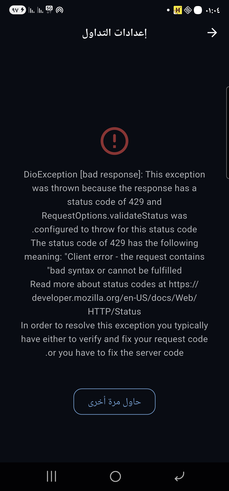

# 🤝 دليل المساهمة - Contributing Guide

<div dir="rtl">

## 🎯 مرحباً بك في المشروع!

نحن نرحب بمساهماتك لتحسين Trading AI Bot. هذا الدليل سيساعدك على البدء.

---

## 📋 قبل المساهمة

### متطلبات التطوير

- Python 3.9+
- Flutter 3.x
- Git
- معرفة بـ FastAPI/Flask
- معرفة بـ Flutter/Dart (للمساهمات في التطبيق)

### إعداد بيئة التطوير

```bash
# 1. Fork المشروع على GitHub

# 2. Clone المشروع
git clone https://github.com/YOUR_USERNAME/trading_ai_bot.git
cd trading_ai_bot

# 3. إضافة upstream remote
git remote add upstream https://github.com/ORIGINAL_REPO/trading_ai_bot.git

# 4. إعداد بيئة Python
python3 -m venv .venv
source .venv/bin/activate
pip install -r requirements-dev.txt

# 5. إعداد pre-commit hooks
pre-commit install

# 6. تشغيل الاختبارات
pytest tests/
```

---

## 🔀 عملية المساهمة

### 1️⃣ إنشاء Branch جديد

```bash
# التأكد من أن main محدث
git checkout main
git pull upstream main

# إنشاء branch جديد
git checkout -b feature/your-feature-name
# أو
git checkout -b fix/bug-description
```

### 2️⃣ كتابة الكود

اتبع معايير الكود:

#### Python Code Style
- اتبع **PEP 8**
- استخدم **type hints**
- اكتب **docstrings** للدوال والكلاسات
- الحد الأقصى لطول السطر: **100 حرف**

```python
def calculate_position_size(
    balance: float,
    risk_percentage: float,
    stop_loss_distance: float
) -> float:
    """
    حساب حجم الصفقة بناءً على المخاطرة
    
    Args:
        balance: رصيد المحفظة
        risk_percentage: نسبة المخاطرة (0-100)
        stop_loss_distance: المسافة من entry إلى stop loss
    
    Returns:
        حجم الصفقة المناسب
    """
    risk_amount = balance * (risk_percentage / 100)
    return risk_amount / stop_loss_distance
```

#### Dart Code Style
- اتبع **Effective Dart**
- استخدم **dartfmt**
- اكتب **documentation comments**

```dart
/// حساب الربح/الخسارة للصفقة
///
/// [entryPrice] سعر الدخول
/// [currentPrice] السعر الحالي
/// [quantity] الكمية
/// [side] نوع الصفقة (long/short)
double calculatePnL({
  required double entryPrice,
  required double currentPrice,
  required double quantity,
  required String side,
}) {
  if (side == 'long') {
    return (currentPrice - entryPrice) * quantity;
  } else {
    return (entryPrice - currentPrice) * quantity;
  }
}
```

### 3️⃣ كتابة الاختبارات

**كل feature جديد يجب أن يحتوي على اختبارات!**

#### Python Tests
```python
# tests/test_position_manager.py
import pytest
from backend.core.position_manager import PositionManager

def test_calculate_position_size():
    """اختبار حساب حجم الصفقة"""
    pm = PositionManager()
    size = pm.calculate_position_size(
        balance=1000.0,
        risk_percentage=2.0,
        stop_loss_distance=0.01
    )
    assert size == 2000.0

def test_calculate_position_size_zero_risk():
    """اختبار مع مخاطرة صفر"""
    pm = PositionManager()
    size = pm.calculate_position_size(
        balance=1000.0,
        risk_percentage=0.0,
        stop_loss_distance=0.01
    )
    assert size == 0.0
```

#### Flutter Tests
```dart
// test/services/portfolio_service_test.dart
import 'package:flutter_test/flutter_test.dart';
import 'package:trading_app/services/portfolio_service.dart';

void main() {
  group('PortfolioService', () {
    test('يحسب إجمالي الربح/الخسارة بشكل صحيح', () {
      final service = PortfolioService();
      final positions = [
        Position(pnl: 100.0),
        Position(pnl: -50.0),
        Position(pnl: 200.0),
      ];
      
      expect(service.calculateTotalPnL(positions), equals(250.0));
    });
  });
}
```

### 4️⃣ تشغيل الاختبارات والفحوصات

```bash
# Python tests
pytest tests/ -v --cov=backend

# Python linting
flake8 backend/
black backend/ --check
mypy backend/

# Flutter tests
cd flutter_trading_app
flutter test

# Flutter analysis
flutter analyze
```

### 5️⃣ Commit التغييرات

اتبع **Conventional Commits**:

```bash
# Feature
git commit -m "feat: إضافة خاصية trailing stop loss ديناميكي"

# Bug Fix
git commit -m "fix: إصلاح خطأ في حساب PnL للـ short positions"

# Documentation
git commit -m "docs: تحديث دليل الاستخدام"

# Refactor
git commit -m "refactor: تحسين بنية PositionManager"

# Test
git commit -m "test: إضافة اختبارات للـ risk calculator"
```

**أنواع الـ Commits:**
- `feat:` - ميزة جديدة
- `fix:` - إصلاح خطأ
- `docs:` - تحديث توثيق
- `style:` - تنسيق كود (لا يؤثر على المنطق)
- `refactor:` - إعادة هيكلة كود
- `perf:` - تحسين أداء
- `test:` - إضافة أو تحديث اختبارات
- `chore:` - مهام صيانة

### 6️⃣ Push و Pull Request

```bash
# Push إلى fork الخاص بك
git push origin feature/your-feature-name

# افتح Pull Request على GitHub
```

**في وصف الـ PR:**
- اشرح ما فعلته
- اربط Issue ذي الصلة (`Closes #123`)
- أضف screenshots إذا كانت تغييرات UI
- ذكر أي breaking changes

**مثال على وصف PR:**
```markdown
## 📝 الوصف
إضافة خاصية trailing stop loss ديناميكي يتكيف مع volatility السوق

## 🔗 Issues
Closes #456

## ✅ Checklist
- [x] أضفت اختبارات
- [x] حدثت التوثيق
- [x] الـ tests تنجح محلياً
- [x] اتبعت code style
- [x] لا يوجد breaking changes

## 📸 Screenshots

```

---

## 🐛 الإبلاغ عن Bugs

استخدم GitHub Issues مع القالب التالي:

```markdown
## 🐛 وصف المشكلة
وصف واضح ومختصر للخطأ

## 🔄 خطوات إعادة الإنتاج
1. اذهب إلى '...'
2. اضغط على '...'
3. شاهد الخطأ

## ✅ السلوك المتوقع
ماذا كنت تتوقع أن يحدث

## 📸 Screenshots
إذا أمكن، أضف screenshots

## 🖥️ البيئة
- OS: [e.g., Ubuntu 22.04]
- Python: [e.g., 3.9.7]
- Flutter: [e.g., 3.10.0]

## 📋 معلومات إضافية
أي سياق آخر مفيد
```

---

## 💡 اقتراح Features

استخدم GitHub Issues مع القالب التالي:

```markdown
## 🚀 Feature Request

### المشكلة
وصف المشكلة التي تحلها هذه الميزة

### الحل المقترح
كيف تتخيل أن تعمل هذه الميزة

### البدائل
هل فكرت في حلول بديلة؟

### معلومات إضافية
أي سياق إضافي أو screenshots
```

---

## 🧪 معايير Quality

### قبل فتح PR، تأكد من:

#### ✅ Backend
- [ ] جميع الـ tests تنجح (`pytest tests/`)
- [ ] لا توجد أخطاء linting (`flake8`, `black`)
- [ ] Type hints موجودة
- [ ] Docstrings محدثة
- [ ] لا توجد أخطاء mypy
- [ ] Code coverage > 80%

#### ✅ Flutter
- [ ] `flutter analyze` بدون أخطاء
- [ ] `flutter test` تنجح
- [ ] UI responsive على أحجام شاشات مختلفة
- [ ] يعمل على iOS و Android
- [ ] لا توجد memory leaks

#### ✅ عام
- [ ] التوثيق محدث
- [ ] CHANGELOG.md محدث
- [ ] لا breaking changes (أو موثقة)
- [ ] PR مرتبط بـ Issue

---

## 🎨 Code Review Process

### ما نبحث عنه:

1. **الصحة**: هل الكود يعمل كما هو متوقع؟
2. **الاختبارات**: هل الـ tests كافية ومفيدة؟
3. **الأداء**: هل يوجد تأثير سلبي على الأداء؟
4. **الأمان**: هل يوجد ثغرات أمنية؟
5. **الوضوح**: هل الكود سهل القراءة والفهم؟
6. **التوثيق**: هل الوثائق واضحة ومحدثة؟

### Timeline

- **Initial Review**: خلال 48 ساعة
- **Follow-up**: خلال 24 ساعة من التحديثات
- **Merge**: بعد موافقة 2 maintainers على الأقل

---

## 🏗️ البنية المعمارية

### Adding New Strategy

```python
# backend/strategies/my_strategy.py
from backend.strategies.base_strategy import BaseStrategy

class MyStrategy(BaseStrategy):
    def detect_entry(self, df, context):
        """منطق كشف إشارة الدخول"""
        # implementation
        pass
    
    def check_exit(self, df, position):
        """منطق كشف إشارة الخروج"""
        # implementation
        pass
```

### Adding New API Endpoint

```python
# backend/api/my_routes.py
from flask import Blueprint, request, jsonify
from backend.utils.auth import require_auth

bp = Blueprint('my_feature', __name__, url_prefix='/api/my-feature')

@bp.route('/data', methods=['GET'])
@require_auth
def get_data():
    """جلب بيانات"""
    # implementation
    return jsonify({'success': True, 'data': []})
```

### Adding New Flutter Screen

```dart
// lib/features/my_feature/screens/my_screen.dart
import 'package:flutter/material.dart';

class MyScreen extends StatelessWidget {
  @override
  Widget build(BuildContext context) {
    return Scaffold(
      appBar: AppBar(title: Text('My Screen')),
      body: Center(child: Text('Hello')),
    );
  }
}
```

---

## 📚 مصادر مفيدة

### Documentation
- [FastAPI Docs](https://fastapi.tiangolo.com/)
- [Flask Docs](https://flask.palletsprojects.com/)
- [Flutter Docs](https://flutter.dev/docs)
- [Riverpod Docs](https://riverpod.dev/)

### Trading & ML
- [ccxt Documentation](https://docs.ccxt.com/)
- [TA-Lib](https://mrjbq7.github.io/ta-lib/)
- [Binance API](https://binance-docs.github.io/apidocs/)

---

## 🙏 شكراً لمساهمتك!

كل مساهمة، مهما كانت صغيرة، تُحدث فرقاً. نحن نقدر وقتك وجهدك!

---

## 📞 تواصل معنا

- **GitHub Issues**: للـ bugs و features
- **Email**: dev@tradingbot.com
- **Telegram**: @TradingBotDev

</div>
